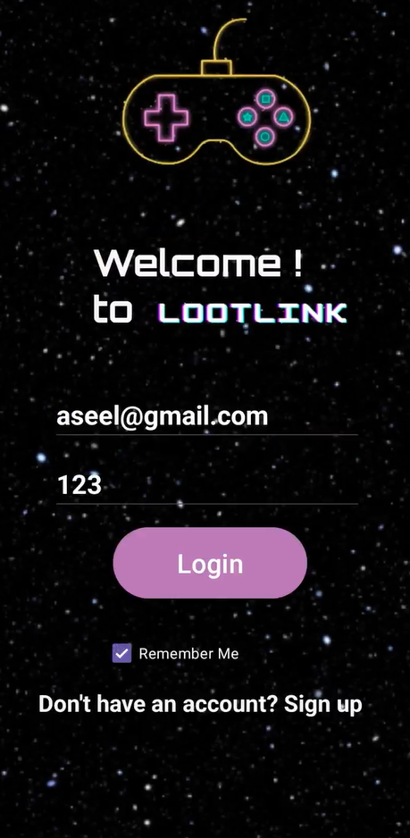
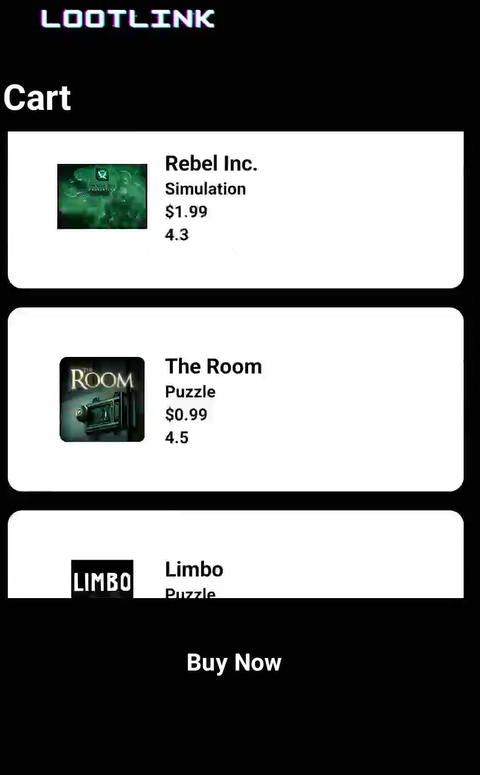
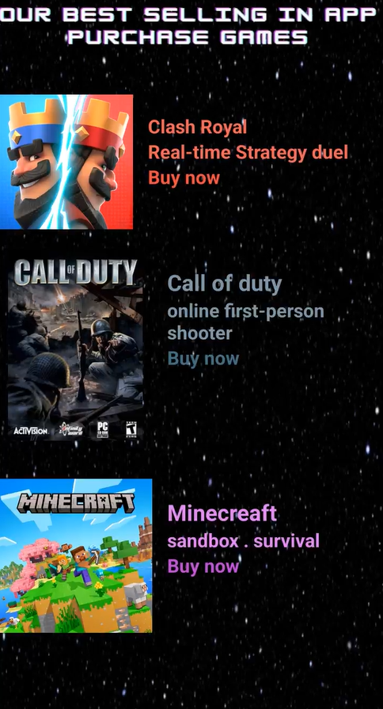
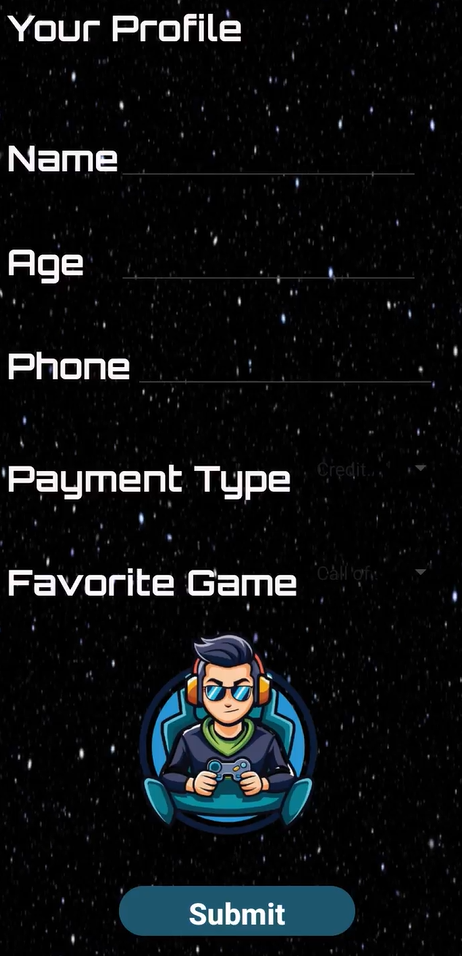
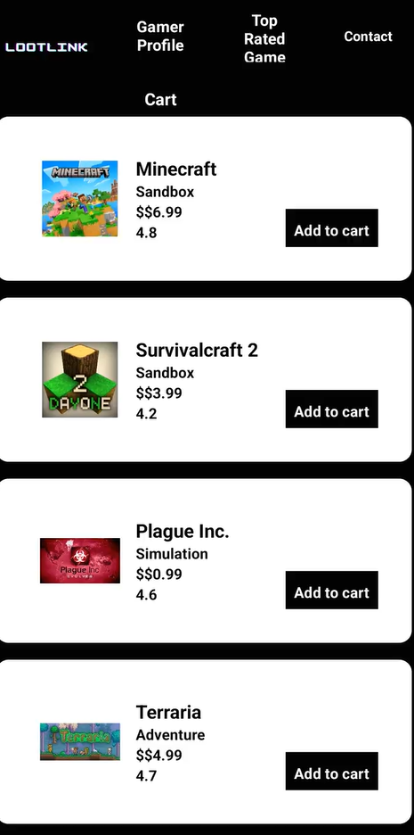
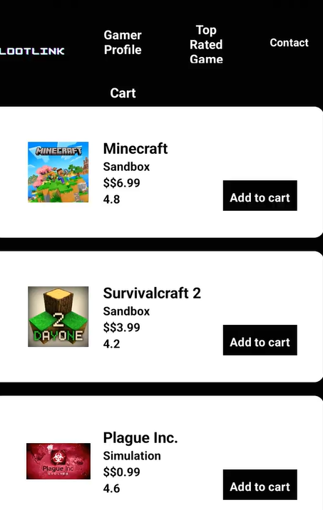

# LootLink — Mobile Game Store (Android)

LootLink is a lightweight Android app for browsing and purchasing popular mobile games.  
Users can explore top-rated titles, review prices and ratings, and manage a shopping cart with ease.  
The app demonstrates core **e-commerce functionality** in a gaming context.  

---

## ✨ Features
- Browse curated games with **price**, **rating**, and **genre**
- Add games to a **shopping cart**
- View and manage cart items
- Gamer profile screen
- Top-rated games section
- Contact screen
- Login screen with session storage (SharedPreferences)

---

## 🧰 Tech Stack
- **Language:** Java (Android)  
- **IDE:** Android Studio  
- **UI:** XML layouts, Material Components  
- **Storage:** SharedPreferences (login/session)  
- **Lists:** RecyclerView  

---

## 📱 Screenshots

  
  
  

  
  
  

---

## 🚀 Getting Started

### Prerequisites
- Android Studio (latest stable)  
- Android SDK 24+  
- Device or emulator  

### Run
1. **Clone** this repository and open it in Android Studio  
2. **Sync Gradle**  
3. **Run** on an emulator or physical device  
4. **Login**, then browse games and add them to the cart  

---

## 🗂 Project Structure (high level)
